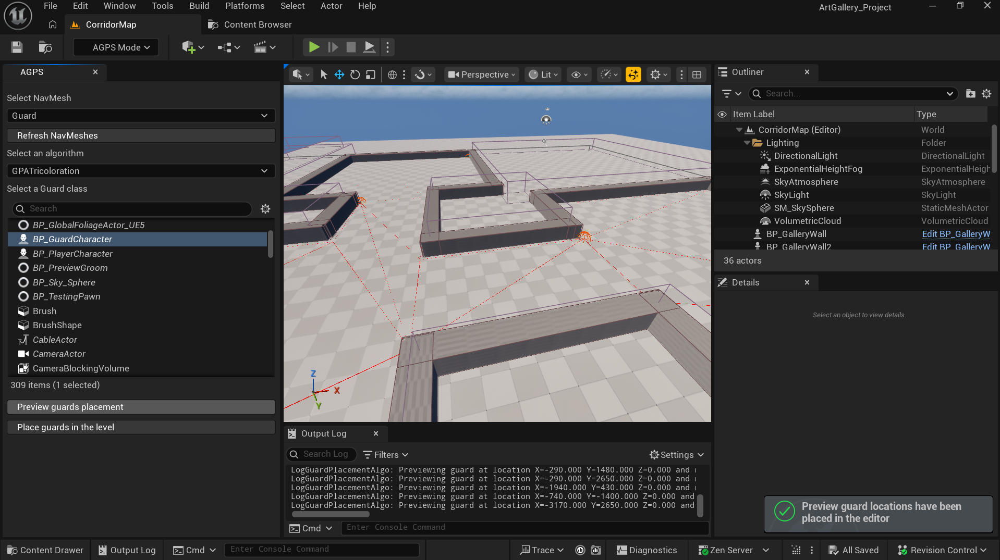
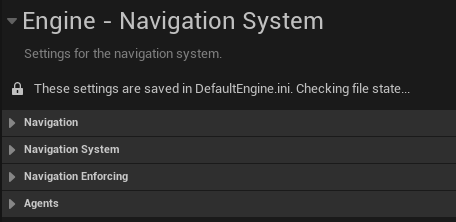
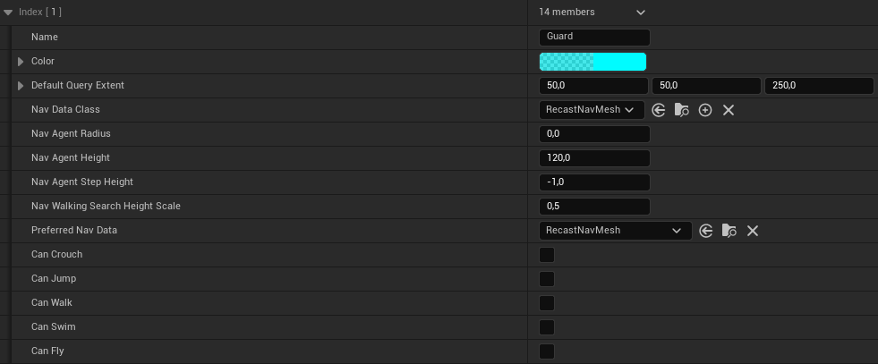
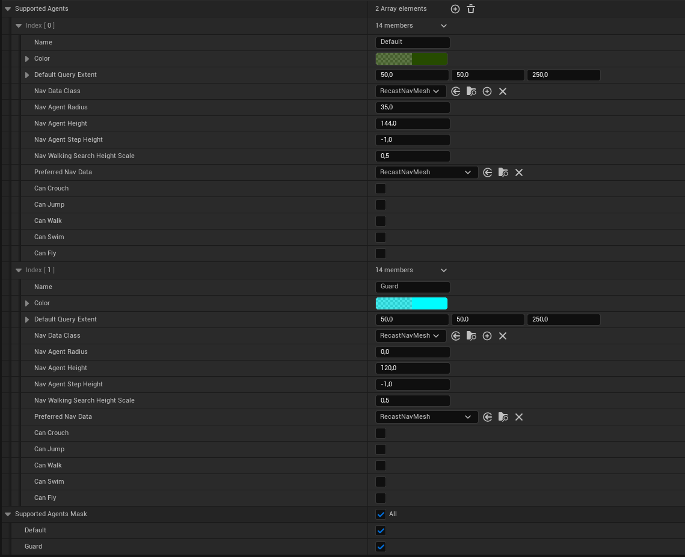
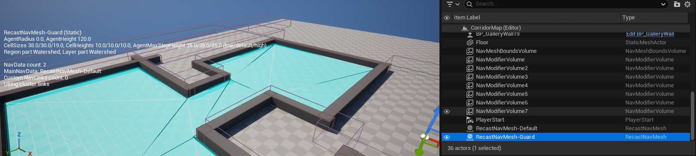

# Automatic Guard Placement System Plugin for Unreal Engine 5
This plugin provides an automatic guard placement system for Unreal Engine 5. Diffrent algorithms can be used / implemented to place guards in a level, based on the geometry of the level and the desired coverage.

## Features
- Automatic guard placement based on level navmesh
- Extendable guard placement algorithms

## How to use

1. Select a navmesh in your level.
2. Select a guard placement algorithm from the dropdown menu.
3. Click the "Place Guards" button to automatically place guards in the level based on the selected algorithm. Or use the "Preview Guards" button to see a preview of the guard placements before placing them.

## Algorithms
The plugin currently includes the following guard placement algorithms:
- **Tricoloration**: This algorithm uses a tricoloration approach to place guards in a way that maximizes coverage while minimizing the number of guards needed. It assigns one of three colors to each guard, ensuring that no two guards of the same color are adjacent to each other.

## Use Unreal navmesh for room triangulation
To apply the selected algorithm to a room modelised in Unreal Engine 5, this plugin currently uses navmeshes to retrieve the room's vertices. 
Note that navmeshes are the native navigation system of Unreal Engine 5.

In order to use this system, a 2-steps setup is required for it to work : 
1. Create a custom navigation mesh
2. Setup the spawned navmesh

But first a brief explanation of what is a navmesh and how does it works.

### What is a navmesh ?
The Navmesh is an invisible layer of geometry that overlays the environments and is commonly used to define the ‘navigable’ areas for AI navigation. 
AI actors use this mesh to calculate the shortest path between point A and point B, while avoiding obstacles.

In this project, we use Navmesh to retrieve paths predefined by Unreal to establish a graph that will be used to place guards at locations computed using algorithms based on the art gallery problem. 
We therefore need a NavMesh optimised to be as simple as possible, representing the map’s edges as much as possible and delineating rooms as polygons divided into triangles.

### How does the Unreal Navmesh system works?
In Unreal Engine 5, a "navmesh" inside a world is separated between 2 different objects : 
- The Navmesh bound volume, which is a volume in which the navmesh will spawn, and so representing its boundaries.
- The **Recast Navmesh**, which is basically the spawned instance of the navmesh.

The recast navmesh is the result of Unreal's navigation system triangulation. It is visible in a world by enabling post-processing vision (default key is P)
The default recast navmesh is represented by a green layer above the level ground.

In order to get the navmesh vertices, we need to get through its architecture which is the following : 
**Tiles -> Polygons -> Triangles -> Vertex**

### Create a custom navigation mesh
As stated before, when creating a custom navmesh, we are actually creating a custom recast navmesh.

To do so, you must follow the following steps : 

1. In your **project settings**, go to **Engine -> Navigation system**

2. Search for the **Agent** setting, and then create 2 new supported agents by clicking on the +.
A supported agent is the definition of the kind of actor that will be using this navmesh (size / radius...). 
Creating a supported agent will allow Unreal to spawn another recast navmesh recast navmesh when placing a navmesh bound volume in a world. 
Note : the first agent created in this list will be the default Unreal agent.
3. Parameter your custom agent. 
- You may name it the way you want. Remember that the name chosen here will be the one you will find inside the plugin.
- The **agent radius** must be **0** 
This will allow Unreal to consider the agent as a point, which is useful to follow more accurately the thesis representation of a guard. Moreover, this will allow to the navmesh to better follow the edes of the map and walls. 
- Finally give it a distinctive color to differentiate its render from the default one.

Example of configuration

With the custom navmesh created, the agents' settings must ressemble to the following : 

### Setup the spawned navmesh
Once the Navmesh bound volume is set in the level, the custom recast navmesh will be spawned in the level and will be visible in the outliner tab with the name : RecastNavmesh-*CustomName*

Here is a quick guideline on how to setup your recast navmesh in order to have a good triangulation of the room.

**Warning** : when changing parameters inside the recast navmesh, it may disappear.
If this happens, go to the "Build" tab and click on "Build Paths"

#### Navmesh visualisation
The basic settings to activate to visualise the navmesh are the following : 
- **Enable Drawing** : Allow the navmesh to be drawn when activating post processing
*Think of having only one recast navmesh with this setting activated for better visibility*

Then add the following depending on your needs : 
- **Draw Triangle Edges**
- **Draw Poly Edges**
- **Draw Filled Polys**
- **Draw NavMesh Edge**

The final render shall resemble the following : 

#### Navmesh triangulation configuration
This section will show the way we have parameterized the recast navmesh in order to achieve a clean room triangulation.

1. Get your custom recast navmesh with an agent radius at 0.
2. Set **Tile Size UU** to the size of your room or a bit larger.
This will allow the navmesh of the room to be made of one tile and so avoid useless points at the section of multiple tiles.
3. In **Advanced** set **Nav Mesh Origin Offest** to half of your room size **for X & Y coordinates** 
This will allow the navmesh tile to start at the corner of your room instead of the middle.
4. Finally "play" with **Max Simplification Error** and **Default Cell Size** in **Nav Mesh Resolution Parameter** to make the triangulation fit to your room.

-  **Max Simplification Error** is usually set to **default value**, but for some maps, it varies between 1.5 and 10. Most of the time its value is close to 2.
-  **Cell Size** is also usually set to its **default value**, but sometimes, it is needed for it to have different values **depending on the room**.

### Architecture of the vision system and wall coverage

#### The perception component (Guard)

The detection system relies on the native `UAIPerceptionComponent`, located in the guard’s controller.

* **Visual configuration:** The `UAISenseConfig_Sight` object is attached to it. It contains parameters defining the guard’s visual profile, such as vision range, field of view angle, and age (visual memory).

* **State update:** The `OnTargetPerceptionUpdated` function listens for stimulus events. When a wall is validly detected, it increments the `GuardSeen` variable to keep track of coverage.

#### Strict visibility logic (Wall)

To prevent the engine from validating the visibility of a wall simply by checking its geometric center, the `AGalleryWall` class implements the `IAISightTargetInterface`. This allows overriding the native `CanBeSeenFrom` function with custom logic.

* **Spatial validation:** The function first uses a dot product to mathematically ensure that the wall is within the guard’s field of view.

* **Obstacle checking:** The system then performs line traces toward two specific components, `LeftExtremity` and `RightExtremity` (previously positioned in the wall’s Blueprint). If no object blocks these lines of sight, the wall is considered fully visible.

#### Known limitations and future improvements

The current algorithm has a major logical flaw. It assumes that a wall is entirely visible if both of its extremities are visible, which is incorrect (a central obstacle could obscure the middle of the wall without blocking the extremities). This system could therefore be reworked.

